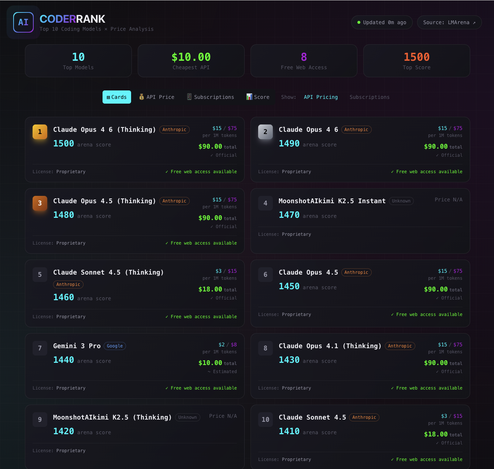
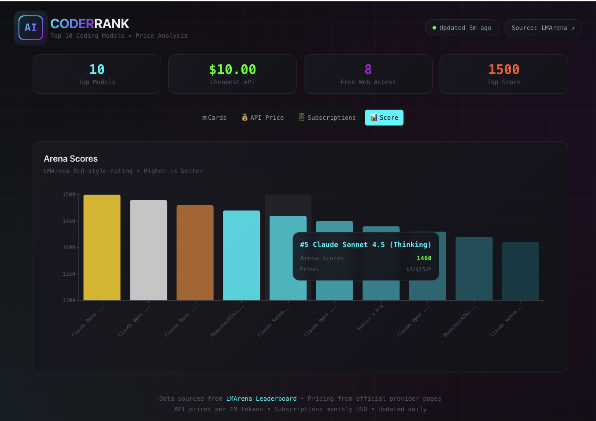
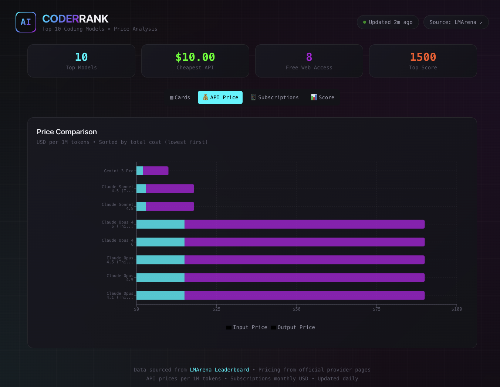
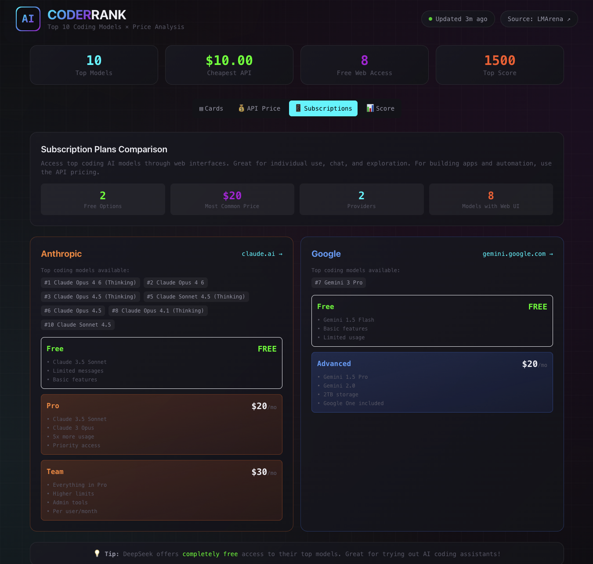

# AI CoderRank

> Top 10 AI coding models ranked by [LMArena](https://lmarena.ai/leaderboard) score with pricing comparison.
**Stack:** Next.js 14 &bull; React &bull; Recharts &bull; Tailwind CSS &bull; Kubernetes &bull; ArgoCD

---

## Screenshots

| Dashboard | Arena Scores |
|:---------:|:------------:|
|  |  |

| API Price Comparison | Subscription Plans |
|:--------------------:|:------------------:|
|  |  |

---

## Quick Start

```bash
npm install
npm run update-data        # fetch leaderboard data (or USE_MOCK_DATA=true)
npm run dev                # http://localhost:3000
```

## Tests

```bash
npm test                   # all tests
npm test -- --watch        # watch mode
```

## Docker & Kubernetes

```bash
# Docker
docker build -t ai-coderrank . && docker run -p 3000:3000 ai-coderrank

# Kubernetes (Kustomize)
kubectl apply -k k8s/
```

ArgoCD application is defined in `argocd/application.yaml` — push to `main` and it syncs automatically.

## GitOps Theme Demo

Change `THEME` in `k8s/configmap.yaml` (`dark` / `light`), commit & push — ArgoCD picks it up. Or use the helper script:

```bash
scripts/switch-theme.sh light
```

## How It Works

```
LMArena ──scrape──▶ Leaderboard Fetcher ──▶ Pricing Service ──▶ data/models.json
                     (cheerio)               (fuzzy match)       (JSON on PVC)
                                                                      │
              Browser ◀── Dashboard ◀── /api/models ◀─────────────────┘
```

A **Kubernetes CronJob** runs the data pipeline daily at 3 AM UTC.
The **Next.js app** serves the dashboard and API from a single container.

## API

| Endpoint | Description |
|----------|-------------|
| `GET /api/models` | Leaderboard + pricing data |
| `GET /api/health` | K8s health probe |
| `GET /api/config` | Runtime config (theme) |

## Configuration

| Variable | Default | Description |
|----------|---------|-------------|
| `DATA_PATH` | `./data/models.json` | Data file location |
| `USE_MOCK_DATA` | `false` | Skip scraping, use mock data |
| `THEME` | `dark` | UI theme (`dark` / `light`) |

## Adding Model Prices

Edit `src/lib/pricing/pricing-data.ts`:

```typescript
'new-model': {
  inputPricePerMillion: 1.00,
  outputPricePerMillion: 2.00,
  source: 'official',
},
```

## License

MIT
